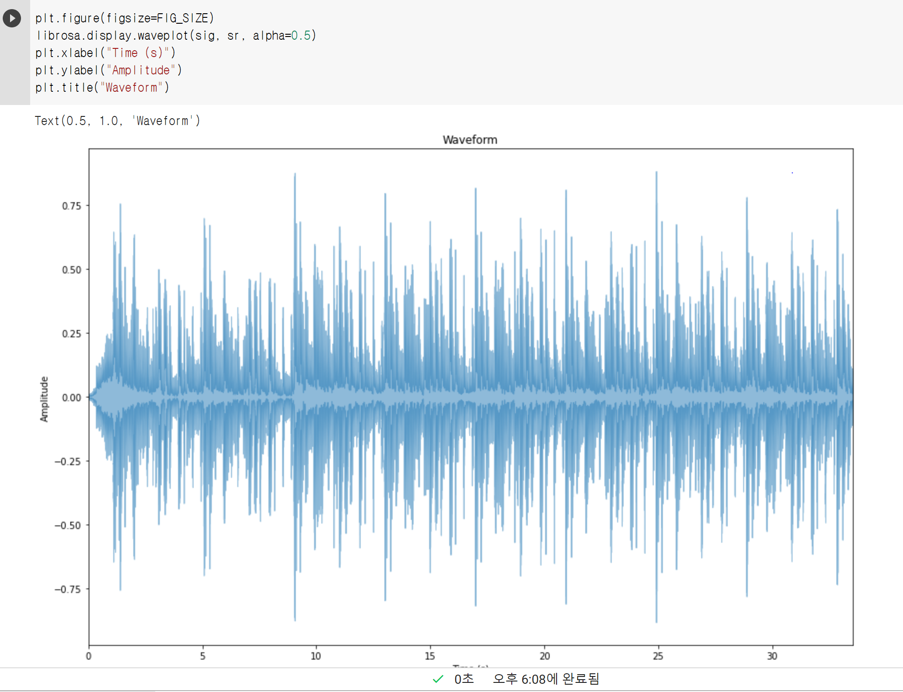
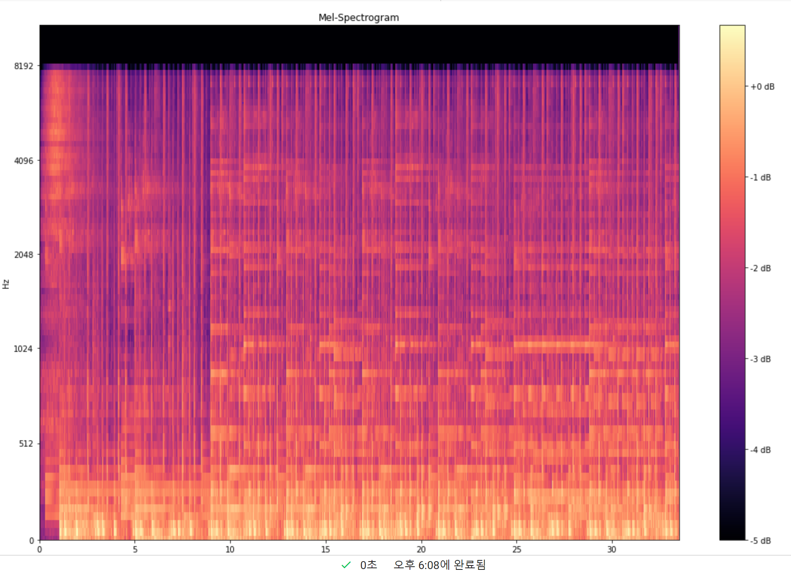
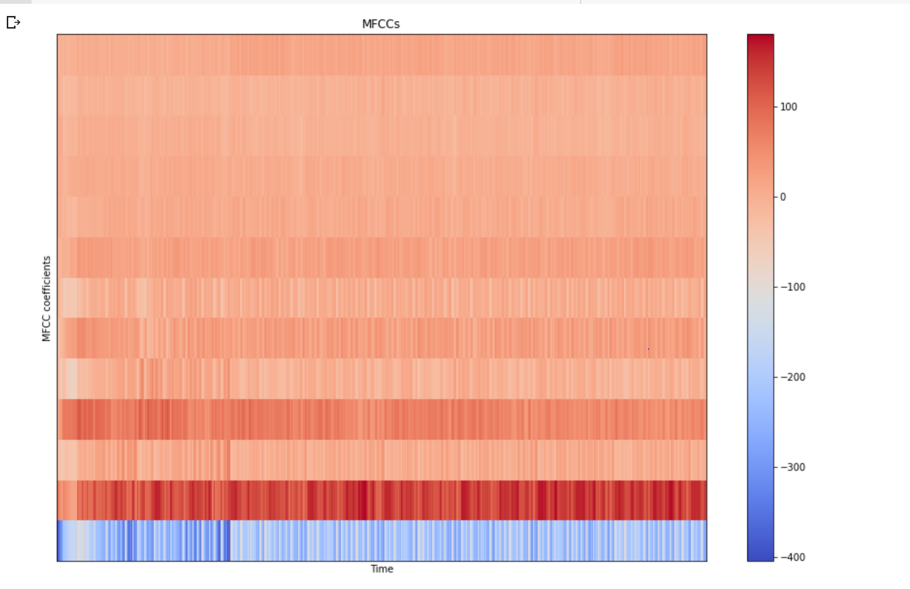
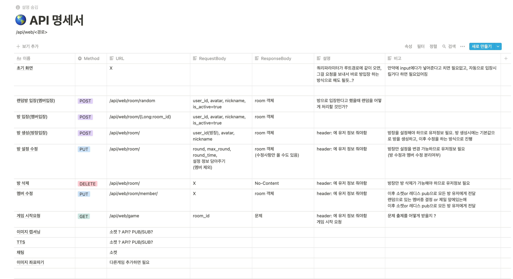
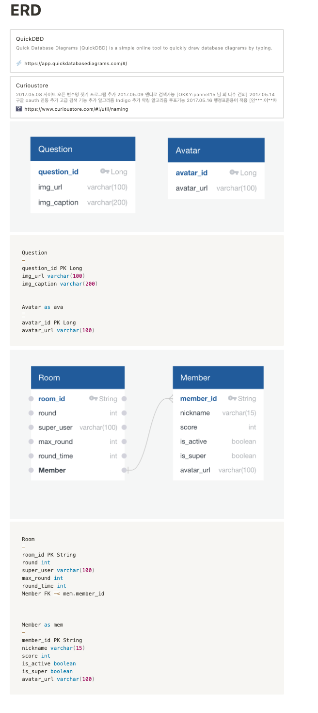

#  데이터

딥러닝에서 신경망을 학습하고 평가하는데 사용하는 data set의 종류


### train set

`학습에 사용하는 유일한 데이터 셋`

### test set

`학습과 검증이 완료된 모델의 성능을 평가하기 위한 데이터 셋`

`학습에 전혀 관여하지 않음 오로지 검증을 위해서만 사용 `

### validation set

`이미 학습이 완료된 모델을 검증하기 위한 데이터 셋`

```
train set으로 학습을 할때 너무 높은 epoch로 학습시키면 overfitting의 문제
validation set이 적절한 epoch를 찾아주고 그만큼만 train set으로 학습하게 해줌. 실제로는 모델자체에 학습시키는데 사용되는 데이터 셋은 아니지만 이런식으로 학습에 관여 한다.
```


# 음성 데이터 전처리 과정 살펴보기

`output = '/content/gdrive/MyDrive/file_example_WAV_2MG.wav'`

적당한 음성 파일을 다운받아 경로 설정해주기

```python
from scipy import signal
# 음성 파일 load
sig, sr = librosa.load(output, sr=22050)
```

음성파일 로드

### Waveform 과 mel-spectrogram






### **푸리에 변환**(**Fourier transform**, FT)

시간이나 공간에 대한 함수를 시간 또는 공간 주파수 성분으로 분해하는 변환

```python
# 단순 퓨리에 변환으로 스펙트럼 구하기
fft = np.fft.fft(sig)
```

X 축은 시간에서 주파수로 되고, Y축은 원래 Y축값에 대한 주파수상의 분포를 의미

### 단시간 푸리에 변환(**STFT**)

시간이 지남에 따라 신호의 국부 섹션에 대한 사인파 주파수 및 위상 내용을 결정하는 데 사용되는 푸리에 관련 변환. 노이즈 감소, 피치 감지, 피치 이동 등의 효과의 음성 응용 분야에서 많이 사용

### MFCC 

오디오 신호에서 추출할 수 있는 feature로, 소리의 고유한 특징을 나타내는 수치입니다. 주로 음성 인식, 화자 인식, 음성 합성, 음악 장르 분류 등 오디오 도메인의 문제를 해결하는 데 사용




---

이미지 링크 수정관련 PUSH


# API 명세



# ERD 설계



# 배포

### AWS, Docker에 Jenkins 이미지 파일 생성

Ubuntu에 Docker 설치 후

- Jenkins이미지 파일 생성 및 실행

  ### Jenkins Docker이미지 가져오기

  `docker pull jenkins/jenkins:lts`

  ### Docker 실행 파일 생성

  ```bash
  #Dockerfile
  FROM jenkins/jenkins:lts
  
  #root 계정으로 변경후, 도커 설치. 
  USER root
  RUN curl -fsSLO <https://get.docker.com/builds/Linux/x86_64/docker-17.04.0-ce.tgz> \\
    && tar xzvf docker-17.04.0-ce.tgz \\
    && mv docker/docker /usr/local/bin \\
    && rm -r docker docker-17.04.0-ce.tgz \\
    && usermod -a -G root jenkins
  
  # Docker compose 설치
  RUN curl -L "<https://github.com/docker/compose/releases/download/1.29.2/docker-compose-$>(uname -s)-$(uname -m)" -o /usr/local/bin/docker-compose
  RUN chmod +x /usr/local/bin/docker-compose
  
  #다시 젠킨스 유저로 변경
  USER jenkins
  ```

  ### Dockerfile 빌드

  `docker build . -t jenkins-docker:latest`

  ### Docker 실행

  ```bash
  docker run --name jenkins-b106 -d -p 7777:8080 -p 50000:50000 -v /var/run/docker.sock:/var/run/docker.sock -v /var/jenkins_home:/var/jenkins_home jenkins-docker:latest
  ```

  ubuntu 의 7777포트와 도커컨테이너(jenkins)의 8080포트를 연결하고

  ubuntu의 50000포트와 도커컨테이너(jenkins)의 50000포트를 매핑한다.

  여기서 docker ps 했을때 실행이 되지 않고, docker logs <container id>로 확인 했을때 실행이 되지 않는다면, 권한 문제를 의심해보자

  `chmod 777 /var/jenkins_home` 로 권한을 준다..

  (권한을 어느정도까지 줘야하는지는 더 알아봐야 한다. 일단 간편하게 777로 줬다.)

  `docker ps` 로 재확인(ubuntu에서)

  ### ubuntu와 container가 제대로 통신중인지 확인하기

  `chmod 666 /var/run/docker.sock`  로 권한을 준후

  `docker exec -it abf21e9a9730 /bin/bash` 로 접속해서

  `docker ps` 로 확인해보고, 결과가 로컬에서와 같은지 확인해보면 된다.
  


	### Jenkins

> 환경설정

/var/jenkins_home/secrets/initialAdminPassword 패스워드 받아와서 접속하기

### Jenkins - Gitlab 연결하기

플러그인 관리에서 Gitlab관련 플러그인 설치 (GitLab, Gitlab Authentication)

Gitlab에서 토큰 발급 받기 (scopes: api)

1. Jenkins관리 →시스템 설정 → Gitlab

2. connection이름 설정 후

3. Host url 입력( `https://ssafy.gitlab.com/` )

4. Credential- Jenkins - add

5. GitLabAPI token- 발급받은 토큰 번호, gitlab로그인 아이디 입력 후 Add

6. Test Connection결과가 Success 면 연결 완료

   


