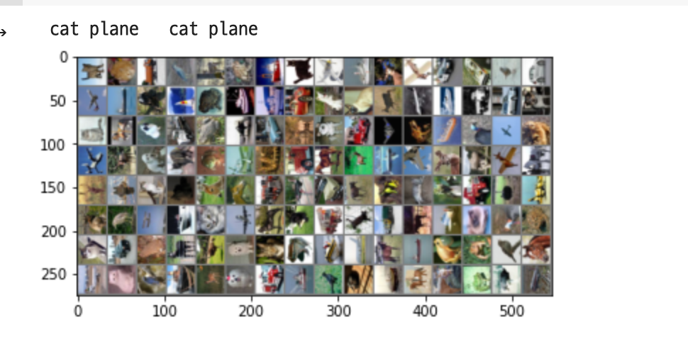

# 01. Anaconda

Download :link: https://www.anaconda.com/products/individual

```bash
% conda-env list # 존재하는 가상환경리스트 조회
% conda list # 현재 환경에 설치된 패키지 확인
% conda create -n mini-ai python=3.7 # 새로운 가상환경 생성
% conda activate mini-ai # 생성한 가상환경 활성화
% conda install pytorch torchvision torchaudio cudatoolkit=10.1 -c pytorch 		 # cudatoolkit은 GPU가 없는 경우 설치X
						#전체한번에 설치가 안되는 경우 각각 설치 해보기
% pip3 install tensorflow # tensorflow 설치

```


# 1-1 Dataset 준비, 전처리

```python
# torch.utils.data.DataLoader class

DataLoader(dataset, batch_size=1, shuffle=False, sampler=None,
           batch_sampler=None, num_workers=0, collate_fn=None,
           pin_memory=False, drop_last=False, timeout=0,
           worker_init_fn=None, *, prefetch_factor=2,
           persistent_workers=False)
```

- `dataset` :  DataLoader클래스의 가장 중요한 파라미터는 dataset이다. 어디서 부터 데이터셋 객체를 가져오는지를 말한다. 두 종류의 데이터셋 타입이 있다.
  - [map-style datasets](https://pytorch.org/docs/stable/data.html#map-style-datasets),
  - [iterable-style datasets](https://pytorch.org/docs/stable/data.html#iterable-style-datasets).

```python
# Req. 1-1	데이터셋 준비 및 전처리
# 이미지를 시각화하는 함수
def visualize(img):
    pass
    # [-1, -1] 범위로 normalize된 데이터를 [0,1] 범위로 unnormalize
    img = img / 2 + 0.5 # [-0.5, 0.5] 인것에 0.5 를 더해 [0, 1]로 normalize
    
    # img를 numpy값으로 변환
    img = img.numpy()

    # plt.imshow함수로 시각화
    plt.imshow(np.transpose(img))

# 트레이닝 데이터를 랜덤 샘플
dataiter = iter(trainloader)
images, labels = dataiter.next() ## image

# show images
visualize(torchvision.utils.make_grid(images))

# print labels
print(' '.join('%5s' % classes[labels[j]] for j in range(4)))
```



