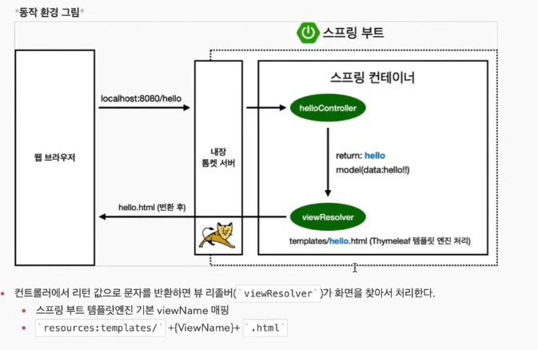

# 스프링

참고 도서

- [배워서 바로 쓰는 스프링 프레임워크](https://ssafy2.dkyobobook.co.kr/content/contentView.ink)
- [스프링 부트 웹애플리케이션 첫걸음](https://ssafy2.dkyobobook.co.kr/content/contentView.ink)

---

## 프로젝트 생성

> `start.spring.io` 로 접속.
>
> Project : Gradle Project
> Lang : Java
> Spring Boot : 
>
> Group : 기업명(도메인)
> Artifact : 프로젝트 명
> Dependencies : 라이브러리
> 	Spring Web : 웹프로젝트
> 	Thymeleaf : 템플릿 엔진 (html)
>
> `Generate` 버튼 클릭

> 다운로드 파일 압축 해제.
>
> ### build.gradle
>
> `build.gradle` Open as project
> plunins 과 Dependencies가 적혀있음.
> **java, String 빨간줄** : project 버전, sdk 버전 일치시켜야함 ㅂㄷㅂㄷ

## MVC와 템플릿 엔진

> Model, View, Controller
>
> Model 화면에 관련된것을 서버에서 화면으로 넘겨주는 역할
>
> View 는 화면
>
> Controller 서버 뒷단의 관련된 것
>
> 
>
> 
>
> **Controller**
>
> ```java
> package hello.firstspring.controller;
> 
> import org.springframework.stereotype.Controller;
> import org.springframework.ui.Model;
> import org.springframework.web.bind.annotation.GetMapping;
> import org.springframework.web.bind.annotation.RequestParam;
> import org.springframework.web.bind.annotation.ResponseBody;
> 
> @Controller
> public class HelloController {
> 
>     @GetMapping("hello")
>     public String hello(Model model) {
>         model.addAttribute("data", "hello!!");
>         return "hello";
> //      tamplate의 hello.html로 렌더링
>     }
> 
>     @GetMapping("hello-mvc")
> //    파라미터를 받을거다.
> //    그냥 넘기면 오류가 난다. 파라미터가 디폴트 값이 true이기 때문에 값이 존재해야함.
>     public String helloMvc(@RequestParam("name") String name, Model model) {
>         model.addAttribute("name", name);
>         return "hello-template";
>     }
> 
>     @GetMapping("hello-string")
>     @ResponseBody //바디부에 응답을 직접 넣어주겠다. 무식하게 문자가 그대로 내려간다. view가 없음.
>     public String helloString(@RequestParam("name") String name) {
>         return "hello " + name; // hello
>     }
> 
>     @GetMapping("hello-api")
>     @ResponseBody
> //    클래스 Hello
>     public Hello helloApi(@RequestParam("name") String name) {
>         Hello hello = new Hello();
>         hello.setName(name);
>         return hello;
>     }
> // 클래스 Hello 선언
> // getter and setter, 단축키 alt + ins
>     static class Hello {
>         private String name;
> 
>         public String getName() {
>             return name;
>         }
> 
>         public void setName(String name) {
>             this.name = name;
>         }
>     }
> }
> ```
>
> 

